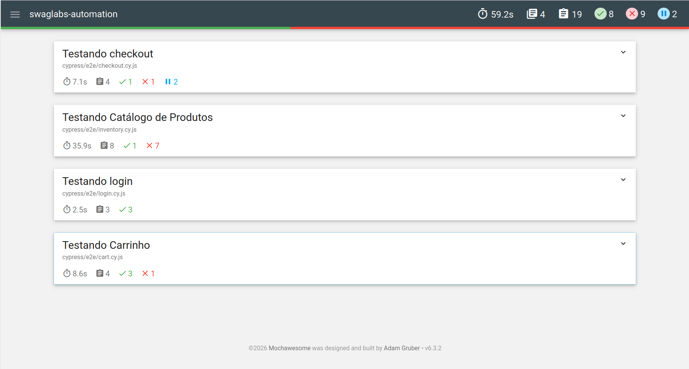

# 🛒 SauceDemo E2E Automation

Projeto de automação de testes End-to-End (E2E) para o e-commerce Swag Labs (SauceDemo), desenvolvido como parte do meu portfólio de QA.


## 📸 Relatório de Execução


## 🛠 Tecnologias Utilizadas
* **Cypress:** Framework de automação e testes.
* **JavaScript:** Linguagem de programação.
* **Mochawesome:** Gerador de relatórios HTML com gráficos.
* **Node.js:** Ambiente de execução.

## 🧪 Cenários Cobertos
1.  **Login:** Autenticação com usuários válidos e tratamento de bloqueios.
2.  **Catálogo:** Adição/Remoção de itens ao carrinho e uso de filtros de ordenação.
3.  **Carrinho:** Validação de persistência de itens e navegação.
4.  **Checkout:** Fluxo completo de compra e validação de formulários obrigatórios.
5.  **Tratamento de Erros:** Testes resilientes que validam mensagens de erro e comportamentos do `problem_user`.

## ⚙️ Como rodar o projeto

1.  Clone o repositório:
    ```bash
    git clone https://github.com/matheuspereirasalvador/swaglabs-cypress-automation.git
    ```
2.  Instale as dependências:
    ```bash
    npm install
    ```
3.  Rode os testes (modo headless com relatório):
    ```bash
    npx cypress run
    ```
4.  Abra o relatório gerado em `cypress/reports/html/index.html`.

---
Desenvolvido por **Matheus Pereira Salvador** 🚀